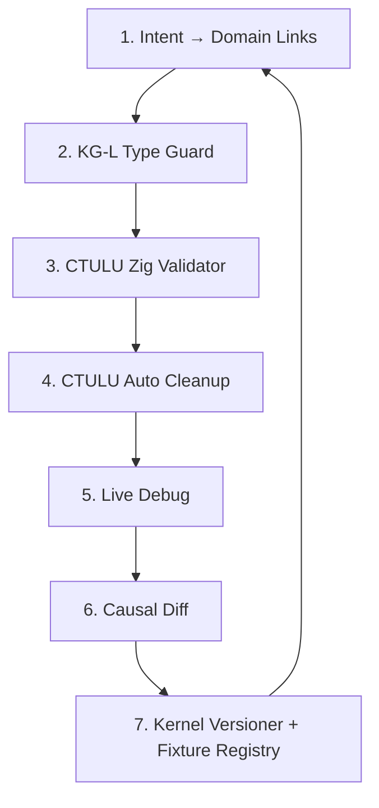

# ADR-2026-08-29-004: Causal Development Loop

## Status
Proposed

## Context
The LLUX resolution required 5+ iterations of trace-insert → rebuild → test → analyze. The iteration cycle was slow because:
- No live debugger for Zig on Windows
- Manual trace insertion/removal
- No automated causal lineage tracking

## Decision
Adopt the **Causal Development Loop** as the mandatory development workflow:

## The 7-Step Causal Dev Loop

### Step 1: Intent → Domain Links
- **Action**: Declare `data.domain`, `kernel.domain`, `intent_hash` in `domain_links.json`
- **Tool**: Manual edit + `BOOT-5ter` regeneration
- **Gate**: `kg-l-type-guard` pre-commit

### Step 2: KG-L Type Guard (Pre-commit)
- **Tool**: `kg-l-type-guard` pre-commit hook
- **Check**: `kernel.domain ⊇ data.domain` for all kernel/loader pairs
- **Fail**: Block commit on domain mismatch

### Step 3: CTULU Zig Validator
- **Command**: `zig_validator.py . --strict --auto-fix --type-guard`
- **Checks**: Build OK, Warnings=0, Format (auto-fix), Type Guard
- **Gate**: Blocks push on any failure

### Step 4: CTULU Auto Cleanup (Pre-build)
- **Hook**: `ctulu-auto-cleanup-hook` in `zig_validator._check_build()`
- **Action**: Kill `llux.exe`, `zig.exe` zombies in workspace
- **Purpose**: Prevent `AccessDenied` on `zig-out/bin/llux.exe`

### Step 5: Live Debug
- **Tool**: `ctulu-zig-debug-adapter` (DAP server)
- **Backend**: `cdb.exe` (WinDbg) + DWARF/CodeView parser
- **Features**: Breakpoints, watch `@Vector`, call stack, evaluate Zig expressions
- **Integration**: VS Code `launch.json` with `"type": "ctulu-zig"`

### Step 6: Causal Diff (Post-commit)
- **Hook**: `post-commit` → `kg-l-causal-diff HEAD~1 HEAD`
- **Output**: `CAUSAL_DIFF.md` with intent_hash
- **CI**: Upload as artifact on every push

### Step 7: Kernel Versioner + Fixture Registry
- **Command**: `kg-l kernel bump <name> --version X.Y.Z --domain NEW_DOMAIN`
- **Actions**: Bump version, migrate fixtures, update `domain_links.json`, generate `CAUSAL_DIFF.md`

## Mandatory Gates
| Gate | Tool | Trigger | Blocks |
|------|------|---------|--------|
| Type Guard | `kg-l-type-guard` | pre-commit | commit |
| Validator | `zig_validator --strict --auto-fix --type-guard` | pre-push / CI | push |
| Cleanup | `ctulu-auto-cleanup-hook` | pre-build | build |
| Causal Diff | `kg-l-causal-diff` | post-commit | - (artifact) |

## Integration Points
- **Pre-commit**: `.pre-commit-config.yaml` → `kg-l-type-guard` + `zig_validator --strict --auto-fix`
- **Pre-build**: `build.zig` step `clean-zombies` → `ctulu-auto-cleanup-hook`
- **Post-commit**: `.git/hooks/post-commit` → `kg-l-causal-diff`
- **CI**: GitHub Actions → `zig_validator --strict --auto-fix --type-guard` + upload `CAUSAL_DIFF.md`

## Metrics
- **Target**: < 5 min from code change to validated commit
- **Target**: Zero silent hangs in production
- **Target**: 100% commits have `CAUSAL_DIFF.md` with `intent_hash`

## IntentHash
**0xADR_CAUSAL_DEV_LOOP_20260829**