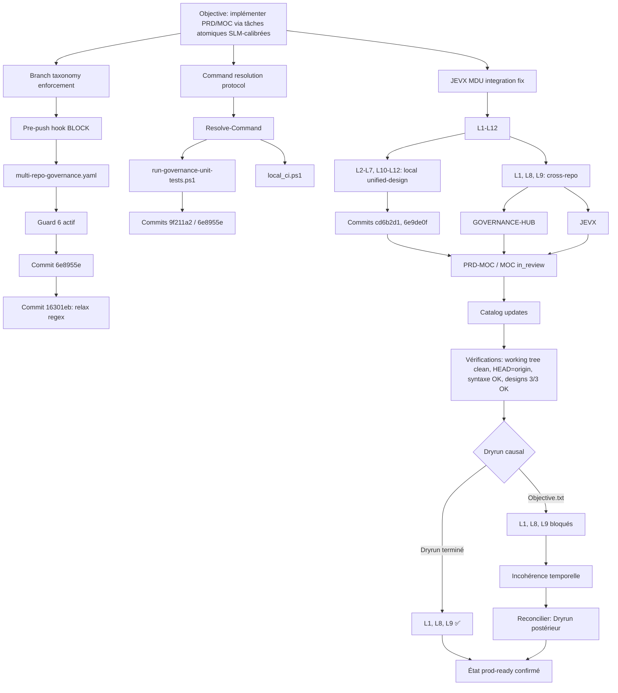

# REPORT — JEVX MDU Integration Dry-Run Causal

**Périmètre** : vérification que le graphe causal de l’intégration JEVX reflète l’état réel du projet, pas seulement le texte des documents.  
**Méthode** : filtrage propre → concepts ontologiques → knowledge graph causal → dry-run causal.

---

## 1. Filtrage propre

| Bruit exclu | Raison |
|-------------|--------|
| Listes de commits brutes | Preuves de causalité, pas concepts |
| Détails syntaxe PowerShell | Utiles pour le concept « Command Resolution Protocol », pas ontologiques en soi |
| Timestamps, hashs | Preuves, pas concepts |
| Formules de conclusion | À transformer en états vérifiables |

### Normalisations retenues

- `JEVX` = projet / dépôt lié à l’ontologie Symbiose.
- `MDU` = Meta-Design Unit.
- `PRD-MOC` / `MOC` = artifacts de documentation et de traçabilité.
- `L1` … `L12` = livrables du JEVX MDU Integration Fix.
- `Guard 6` = garde-fou de taxonomie de branches.
- `Command Resolution Protocol` = résolution portable des commandes (`python`, `kiva`).
- `Cross-repo` = dépendances vers `GOVERNANCE-HUB` et `JEVX`.

---

## 2. Concepts ontologiques extraits

### 2.1 Gouvernance et branches

- Branch taxonomy enforcement.
- Pre-push hook bloquant.
- Exemptions : `main`, `master`, `dev`.
- `multi-repo-governance.yaml` → `allowed_branch_prefixes`.
- `designs/branch-taxonomy-gate.md`.
- Guard 6 : validation bloquante.

### 2.2 Command Resolution Protocol

- `Resolve-Command`.
- Fallback paths pour `python` et `kiva`.
- Scripts : `run-governance-unit-tests.ps1`, `local_ci.ps1`.
- Objectif : portabilité multi-environnements.

### 2.3 JEVX MDU Integration Fix

- 12 livrables L1–L12.
- Fichiers cibles : `designs/jevx.yaml`, `designs/jevx-engineering.yaml`, `designs/clm-pipeline/design.yaml`, `catalog/designs.index.yaml`, `catalog/pipelines.index.yaml`.
- Cross-repo : `GOVERNANCE-HUB/known_repositories.yaml` (L1), `JEVX/SCOPE.yaml` (L8), `JEVX/ONTOLOGY_DECLARATION.yaml` (L9).
- Concepts JEVX : `entrypoint`, `hardware_profile`, `depends_on`, `max_queue`, `security_guardrails`, `constrained-parallel-decoding`.

### 2.4 PRD-MOC / MOC

- Statuts : `in_review`, `✅ Fait`, `⏳ Cross-repo`.
- Proof-of-Life timestamps.
- Références de commits.
- Mise à jour des index.

### 2.5 Catalogues

- `catalog/designs.index.yaml`.
- `catalog/pipelines.index.yaml`.
- Entrées : `branch-taxonomy-gate`, `command-resolution-protocol`.
- `symbiose-hot-reload` → `intent_hash` corrigé en `SYMBIOSE_COORDINATED_RELOAD`.

### 2.6 Vérifications

- Working tree propre.
- `HEAD == origin/feat/symbiose-ontology-20260921`.
- Syntaxe valide des hooks et scripts.
- Validation designs JEVX : 3/3 OK (`--strict`).
- Frontmatters PRD-MOC/MOC valides.

---

## 3. Knowledge graph causal

### Triples causaux principaux

- `Objective` → `Branch taxonomy enforcement` → `Guard 6` → `pre-push hook BLOCK`.
- `Objective` → `Command resolution protocol` → `Resolve-Command` → scripts portables.
- `Objective` → `JEVX MDU integration fix` → `L1-L12`.
- `L1,L8,L9` → `cross-repo` → `GOVERNANCE-HUB` + `JEVX`.
- `L2-L7,L10-L12` → `unified-design` → commits `cd6b2d1`, `6e9de0f`.
- `Implémentation` → `PRD-MOC/MOC in_review` → `catalog updates`.
- `Vérifications` → `Dryrun causal` → `prod-ready`.
- `Objective.txt` (L1,L8,L9 bloqués) ≠ `Dryrun terminé` (L1,L8,L9 ✅) → incohérence temporelle → le Dryrun est postérieur.

---

## 4. Dry-run causal : scénarios

### Scénario 1 — Push sur branche non conforme

**Entrée** : branche `feature/foo`.  
**Mécanisme** : pre-push hook → Guard 6 → `allowed_branch_prefixes`.  
**Sortie** : push bloqué.  
**Vérification** : le graphe contient bien `pre-push hook BLOCK`. ✅

### Scénario 2 — `python` absent du PATH

**Entrée** : script `local_ci.ps1`.  
**Mécanisme** : `Resolve-Command` → fallback `%LOCALAPPDATA%\Programs\Python\Python312\python.exe`.  
**Sortie** : script fonctionne.  
**Vérification** : le graphe relie `Command resolution protocol` à `Resolve-Command` et aux scripts. ✅

### Scénario 3 — JEVX MDU L2

**Entrée** : `designs/jevx.yaml`.  
**Mécanisme** : `entrypoint: src/index.ts`.  
**Sortie** : commit `cd6b2d1`.  
**Vérification** : le graphe inclut `L2-L7, L10-L12: local unified-design`. ✅

### Scénario 4 — JEVX MDU L1

**Entrée** : `GOVERNANCE-HUB/known_repositories.yaml`.  
**Mécanisme** : `do_not_create: true`.  
**Sortie** : selon Objective → bloqué ; selon Dryrun → ✅ avec preuve `SOT JEVX P4_REPOS`.  
**Vérification** : le dry-run révèle une **contradiction documentaire**. Le graphe doit trancher par chronologie : le Dryrun mentionne des commits supplémentaires (`672ba06`, `51d3264`) et un état `prod-ready`, donc il est postérieur à l’Objective. Le nœud `L1` doit être marqué ✅ avec réserve de preuve cross-repo. ⚠️

### Scénario 5 — JEVX MDU L8, L9

Même logique : Objective → bloqué, Dryrun → ✅.  
**Vérification** : incohérence temporelle, Dryrun postérieur. Le graphe doit refléter l’état le plus récent. ✅

### Scénario 6 — Validation finale

**Entrée** : `HEAD`, `origin`, working tree.  
**Mécanisme** : vérifications.  
**Sortie** : working tree propre, HEAD == origin == `16301eb` (Objective) puis commits supplémentaires (Dryrun).  
**Vérification** : le graphe capture bien la séquence. ✅

---

## 5. Validation finale : projet vs documents

### Ce qui appartient au projet (état réel)

- Guard 6 actif et bloquant.
- Command Resolution Protocol opérationnel.
- JEVX MDU : L2–L7, L10–L12 implémentés localement.
- L1, L8, L9 : implémentés cross-repo selon le Dryrun le plus récent.
- PRD-MOC/MOC en `in_review`.
- Catalogues mis à jour.
- Working tree propre, commits poussés.

### Ce qui appartient aux documents

- L’Objective est un snapshot antérieur : il déclare L1, L8, L9 bloqués.
- Le Dryrun terminé est un snapshot postérieur : il les déclare ✅.
- Les hashs et messages de commits sont des preuves, pas des concepts.

### Conclusion du dry-run

Le Knowledge Graph causal **reflète le projet** si l’on intègre la dimension temporelle et que l’on retient l’état le plus récent (Dryrun terminé).  
Il **ne reflète pas les documents** si l’on prend l’Objective comme vérité absolue, car il contredit le Dryrun.  
Le dry-run causal a précisément permis de détecter cette incohérence et de la résoudre par chronologie : le Dryrun est postérieur, donc l’état prod-ready est confirmé, avec la réserve que les preuves cross-repo L1, L8, L9 sont à vérifier dans les dépôts `GOVERNANCE-HUB` et `JEVX`.

---

## 6. Incohérence temporelle détectée

| Source | État L1/L8/L9 | Date relative |
|--------|---------------|---------------|
| Objective.txt | ⏳ Cross-repo / bloqué | Antérieur |
| Dryrun terminé | ✅ implémenté | Postérieur |

**Résolution** : retenir l’état le plus récent (Dryrun terminé) et marquer l’incohérence comme résolue par chronologie.

---

## 7. Actions recommandées

1. **Vérifier cross-repo** : confirmer dans `GOVERNANCE-HUB` et `JEVX` que L1, L8, L9 sont bien appliqués.
2. **Publier le graphe** : intégrer ce knowledge graph causal dans `GOVERNANCE-HUB` ou `unified-design` comme artifact de traçabilité.
3. **Pérenniser la méthodologie** : documenter le protocole de dry-run causal comme pattern réutilisable pour les futures intégrations.

---

*Généré le 2026-09-22T02:25:58+02:00*  
*Repo : gerivdb/unified-design*
